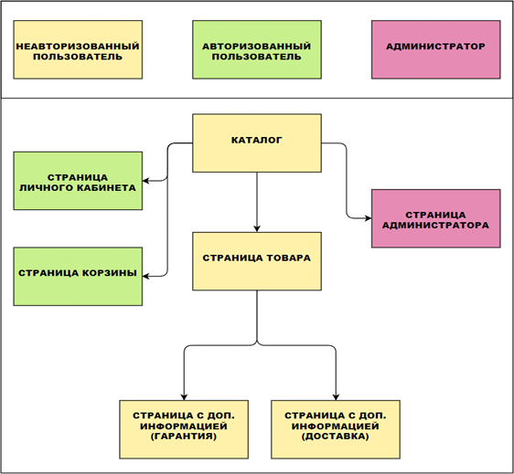
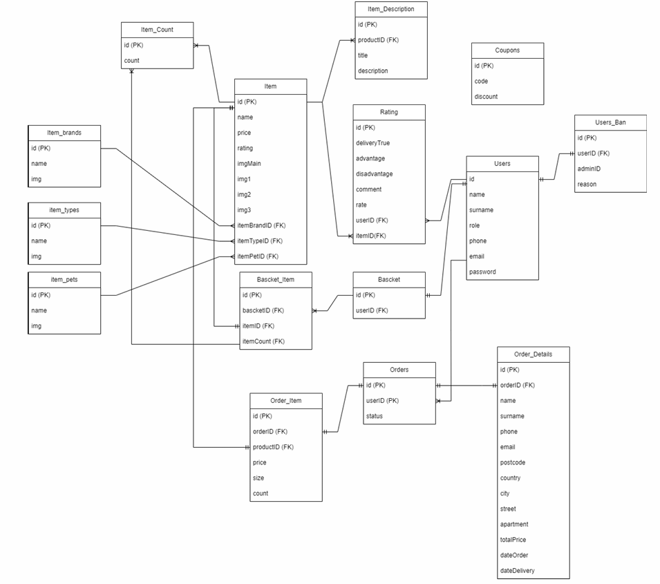
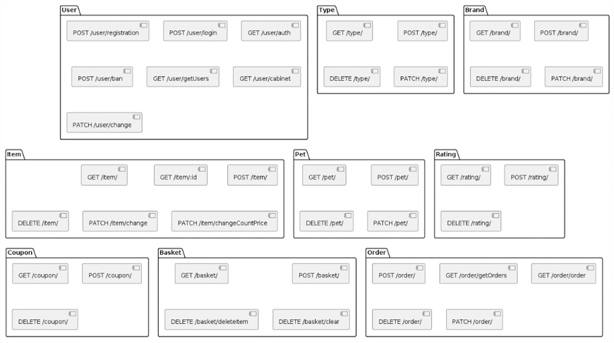

# О проекте
- Цель работы заключается в создании полнофункционального веб-приложения интернет-магазина зоотоваров, отвечающего требованиям целевой аудитории и демонстрирующего преимущества использования современных фреймворков в процессе разработки.

# Использованные технологии
- Frontend (ReactJS, MobX, Bootstrap)
- Backend (NodeJS, Express, ORM(Sequalize), JWTToken)
- DB (PostgreSQL)

# Описание проекта
Проект представляет собой веб-приложение интернет-магазина зоотоваров с функционалом для удобного поиска, просмотра и заказа товаров. 
- Пользователи могут оставлять отзывы, заказывать товары и отслеживать статус заказов. 
- Для администраторов разработана админ-панель, через которую можно управлять товарами, категориями, брендами, а также обрабатывать заказы и взаимодействовать с пользователями. 
- Приложение использует стек технологий ReactJS, NodeJS, ExpressJS и PostgreSQL для создания масштабируемого, безопасного и высокопроизводительного решения.

# Карта сайта

# Логическая модель базы данных

# Диаграмма API
